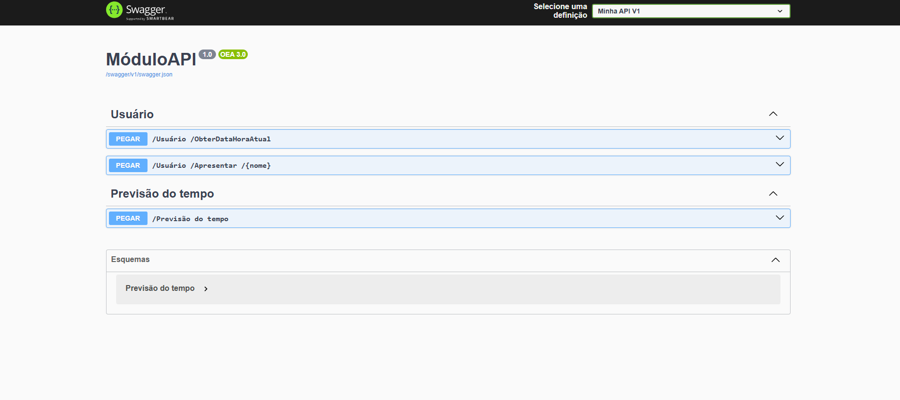

# ModuloAPI

Uma API RESTful desenvolvida em .NET 8 para demonstrar funcionalidades básicas de Web API com documentação Swagger.

## 📋 Funcionalidades

- **Weather Forecast**: Endpoint para obter previsão do tempo simulada
- **Usuário**: Endpoints para operações relacionadas ao usuário
- **Documentação Swagger**: Interface interativa para testar a API
- **Hot Reload**: Desenvolvimento com recarga automática

## 🚀 Tecnologias Utilizadas

- **.NET 8**
- **ASP.NET Core Web API**
- **Swagger/OpenAPI** para documentação
- **C#** como linguagem principal

## 📁 Estrutura do Projeto

```
ModuloAPI/
├── Controllers/
│   ├── WeatherForecastController.cs    # Controlador de previsão do tempo
│   └── UsuarioController.cs            # Controlador de usuário
├── Properties/
│   └── launchSettings.json             # Configurações de inicialização
├── Program.cs                          # Ponto de entrada da aplicação
├── ModuloAPI.csproj                    # Arquivo de projeto
└── README.md                           # Documentação do projeto
```

## 🛠️ Como Executar

### Pré-requisitos
- [.NET 8 SDK](https://dotnet.microsoft.com/download/dotnet/8.0)

### Executando o Projeto

1. **Clone o repositório**
   ```bash
   git clone <url-do-repositorio>
   cd ModuloAPI
   ```

2. **Restaure as dependências**
   ```bash
   dotnet restore
   ```

3. **Execute a aplicação**
   ```bash
   dotnet watch run
   ```

4. **Acesse a API**
   - Interface Swagger: `http://localhost:5298/`
   - Documentação JSON: `http://localhost:5298/swagger/v1/swagger.json`

## 📚 Endpoints Disponíveis

### WeatherForecast
- **GET** `/WeatherForecast`
  - Retorna uma lista de previsões do tempo simuladas
  - Resposta: Array de objetos com data, temperatura e descrição

### Usuario
- **GET** `/Usuario/ObterDataHoraAtual`
  - Retorna a data e hora atual do servidor
  - Resposta: Objeto com data e hora formatadas

- **GET** `/Usuario/Apresentar/{nome}`
  - Retorna uma mensagem de boas-vindas personalizada
  - Parâmetro: `nome` (string)
  - Resposta: Mensagem de boas-vindas

## 📱 Interface da API

A API inclui uma interface Swagger interativa que permite:
- Visualizar todos os endpoints disponíveis
- Testar endpoints diretamente no navegador
- Ver exemplos de request/response
- Baixar a especificação OpenAPI


*Captura de tela da interface Swagger mostrando os endpoints disponíveis*

## 🔧 Exemplos de Uso

### Obter Previsão do Tempo
```bash
curl -X GET "http://localhost:5298/WeatherForecast" -H "accept: application/json"
```

**Resposta:**
```json
[
  {
    "date": "2025-06-25T00:00:00",
    "temperatureC": 32,
    "temperatureF": 89,
    "summary": "Hot"
  },
  {
    "date": "2025-06-26T00:00:00",
    "temperatureC": 14,
    "temperatureF": 57,
    "summary": "Bracing"
  }
]
```

### Obter Data e Hora Atual
```bash
curl -X GET "http://localhost:5298/Usuario/ObterDataHoraAtual" -H "accept: application/json"
```

**Resposta:**
```json
{
  "data": "terça-feira, 24 de junho de 2025",
  "hora": "14:30"
}
```

### Apresentação Personalizada
```bash
curl -X GET "http://localhost:5298/Usuario/Apresentar/Natasha" -H "accept: application/json"
```

**Resposta:**
```json
{
  "mensagem": "Bem-vindo ao ModuloAPI, Natasha!"
}
```

## 🔄 Desenvolvimento

### Adicionando Novos Endpoints

1. Crie um novo controller na pasta `Controllers/`
2. Herde de `ControllerBase` e adicione `[ApiController]`
3. Configure a rota com `[Route("[controller]")]`
4. Adicione métodos HTTP com atributos como `[HttpGet]`, `[HttpPost]`, etc.

### Exemplo de Novo Controller
```csharp
[ApiController]
[Route("[controller]")]
public class NovoController : ControllerBase
{
    [HttpGet]
    public IActionResult Get()
    {
        return Ok("Novo endpoint funcionando!");
    }
}
```

## 📝 Dependências

- **Swashbuckle.AspNetCore**: Geração de documentação Swagger
- **Microsoft.AspNetCore.OpenApi**: Suporte a OpenAPI

## 🤝 Contribuindo

1. Faça um fork do projeto
2. Crie uma branch para sua feature (`git checkout -b feature/nova-feature`)
3. Commit suas mudanças (`git commit -am 'Adiciona nova feature'`)
4. Push para a branch (`git push origin feature/nova-feature`)
5. Abra um Pull Request


## 👥 Autor

**Natasha** - Desenvolvimento inicial

---

⭐ Se este projeto foi útil para você, considere dar uma estrela!